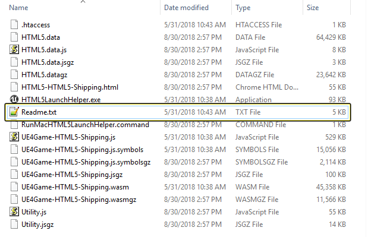

Availability: Public
Title: Developing HTML5 Projects
Description: Setting up UE4 for HTML5 development.
Version: 4.22
Parent: Platforms/HTML5
Tags: HTML5
Tags: StartingOut
Tags: Experimental
Order: 0

## HTML5 SDK Setup

The Unreal Engine 4 (UE4) HTML5 implementation utilizes the [Emscripten](https://developer.mozilla.org/en-US/docs/Mozilla/Projects/Emscripten) toolchain from [Mozilla](http://kripken.github.io/emscripten-site/) to cross-compile UE4's C++ code into Javascript. When you download UE4 from either the Epic Games Launcher or from Epic's Github repository all of the needed **Emscripten **and **Python **files for HTML5 development will be included. This means that you can start creating HTML5 projects without having to perform any additional setup steps or install any additional software.

## HTML5 Supported Web Browser

While you can run your UE4 HTML5 project with **32-bit **web browser, using a **64-bit** version web browser is highly recommended. You can find 64-bit versions of the Google Chrome and Firefox web browsers using the following links

*   [Google Chrome 64 Bit](https://www.google.com/chrome/beta/)

*   [Firefox 64 Bit](https://www.mozilla.org/en-US/firefox/all/)

## Multithread Support

Experimental multithreaded support is available using UE4 builds built from source. 

Some browsers will need special flags enabled to be allowed to run in multithreaded mode.

*   In Chrome: launch with the following flags: `--js-flags=--experimental-wasm-threads --enable-features=WebAssembly,SharedArrayBuffer`. Alternately, these can be enabled and disabled in `chrome://flags/#enable-webassembly-threads` as "WebAssembly threads support".

*   In Firefox nightly, SharedArrayBuffer can be enabled in `about:config` by setting the `javascript.options.shared_memory preference to true`.

## HTML5 Required Project Setup

In Order to get your UE4 powered HTML5 project working correctly you will need to disable MSAA from the [Project Settings](https://docs.unrealengine.com/en-US/Engine/UI/ProjectSettings). This can be done by going to** Project Settings** > **Rendering **> **Mobile **and then setting the **Mobile MSAA **option to **No ****MSAA****.**

## HTML5 Build Type

When creating a build of your HTML5 project, you have the option of creating a **Development** **Build** or a **Shipping** **Build**. The type of build that you create for your project depends on what you are trying to accomplish. 

**HTML5 Development Builds:**

*   Development builds are used when you are testing or debugging your project before you want to release it.

*   Development builds only build uncompressed files.

*   Development builds will only work with local testing and are not meant to be deployed to a website. 

    [REGION:note]
    You can find more information about building your project for Development in the Readme.txt file that is generated when your project is built.
    [/REGION]

**HTML5 Shipping Builds:**

*   Shipping builds are used when you are ready to release your project to end users.

*   Shipping builds can be built to use either compressed or uncompressed files.

*   Shipping builds can be compressed for smaller download size. 

You can enable or disable compressing files for shipping HTML5 builds by doing the following:

1.  Go to **Project Settings** >**Platforms** \> **HTML5** \> **Packaging** and then make sure to enable **Compress files during shipping packaging.**
    [REGION:lightbox]
    
    [/REGION]
    Click for full image.

1.  It is also recommended that you **disable**  the **Use Pak File** option by going to **Project Settings** > **Packaging** > **Packaging** and disable the **Use Pak File** option by clicking on the box next to its name.
    [REGION:lightbox]
    
    [/REGION]
    [REGION:caption]
    Click for full image.
    [/REGION]
    [REGION:note]
    You can find more information about building your project for Shipping in the Readme.txt file that is generated when your project is built.
    [/REGION]

## Launching HTML5 Projects

Once you have installed one of the compatible web browsers you can then test one of your HTML5 project. You can do this by going to the **Main Tool Bar** and clicking on the **Advanced options **dropdown next to the **Launch** option. Then from the from the displayed menu, select the browser you wish to use by clicking on it.

## Packaging HTML5 Projects

To create a packaged HTML5 project that can be deployed to the web, you will need to make sure to do the following.

1.  First, go to **File** \> **Package** **Project** and select **HTML5** from the list.
    

1.  Select a folder for the project to be saved and then click **Select Folder** to start the packaging process.

1.  Once the project has finished being packaged, open the folder the project was packaged to and run the **HTML5LaunchHelper.exe** program.
    

1.  The **HTML5LaunchHelper.exe** program will launch a web server which is configured to serve compressed files on localhost. You can see the progress of this server in the command line window that is displayed when the **HTML5LaunchHelper.exe** program is run.
    

1.  Finally, open up your 64-bit web browser of choice and input the following URL; \[**Localhost** **Address**\]/\[**ProjectName**\].html. This will load your UE4 HTML5 project in the web browser like in the image below.
    
    [REGION:note]
    The URL that you input is based off of your project name. With the above project called ThirdPerson the address that should be input would be http://localhost:8000/**ThirdPerson**.html
    [/REGION]

## HTML5 Read Me File

When you create a new HTML5 project there will be a text file that is generated by UE4 called **Readme.txt**. Inside of this file you will find additional information on how to get your HTML5 project working both locally and on the web. 

## HTML5 File Types

When building your UE4 project for development or deployment with HTML5 you have the option to use compressed or uncompressed files. The following chart breaks down what files are required for uncompressed builds and what information these files contain. 

**Files Required for Non-Compressed Files Deployment** \- The following files are created when a non-compressed build is created.

[REGION:simpletable]
|File Type|Description|
| --- | --- |
| **<project>.js** | Main project Javascript code. |
| **<project>.wasm** | Main game code. |
| **<project>.data** | Game content Javascript driver. |
| **<project>.html** | Landing page. |
| **<project>.symbols** | Symbols (optional: used with debugging). |
| **Utility.js** | Utility Javascript code. |
| **.htaccess** | Distributed configuration file |
[/REGION]

**Files Required for Compressed Files Deployment** \- The following files are created when a compressed build is crated.

[REGION:simpletable]
|File Type|Description|
| --- | --- |
| **<project>.jsgz** | Compressed main project Javascript code. |
| **<project>.wasmgz** | Compressed main game code. |
| **<project>.datagz** | Compressed game content. |
| **<project>.data.jsgz** | Compressed game content Javascript driver. |
| **<project>.symbolsgz** | Compressed symbols (optional: used with debugging). |
| **Utility.jsgz** | Compressed utility Javascript code. |
[/REGION]

[REGION:note]
When using the compressed version of the files you will also need to make sure to include the uncompressed version of the **.htaccess** file and the **.html** file.
[/REGION]

**Files not needed for Deployment** -The following files are created when both a compressed and uncompressed version of the project is created. However these files are only needed when your project is under development or being tested.

[REGION:simpletable]
|File Name|Description|
| --- | --- |
| **HTML5LaunchHelper.exe** | Used to create a local web server to view your project locally on Windows based PC’s. |
| **RunMacHTML5LaunchHelper.command** | Used to create a local web server to view your project locally on Mac. |
| **Readme.txt** | Contains additional information about deploying UE4 project for HTML5. |
[/REGION]
