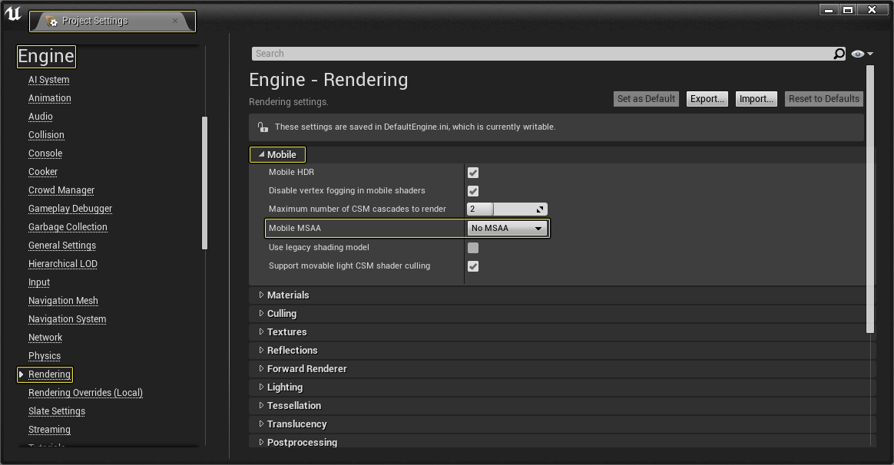
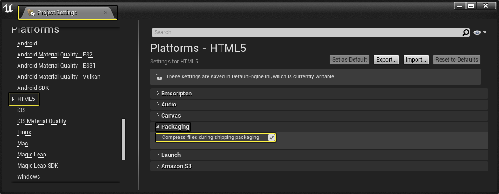
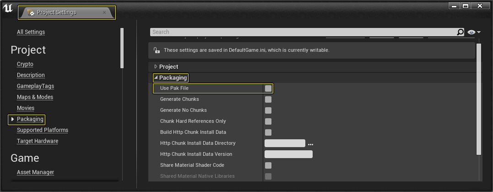
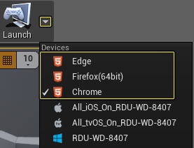
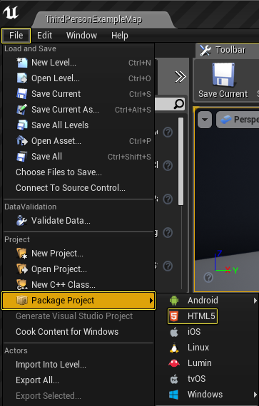
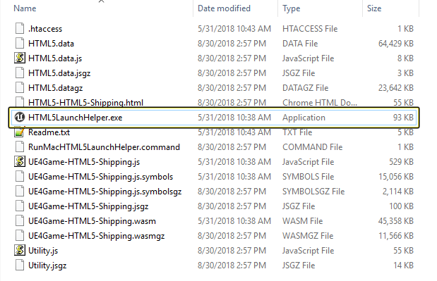
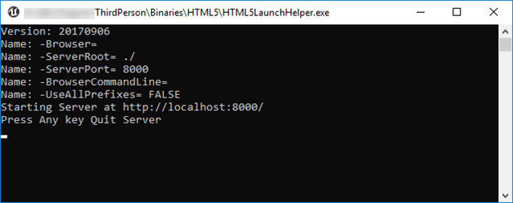
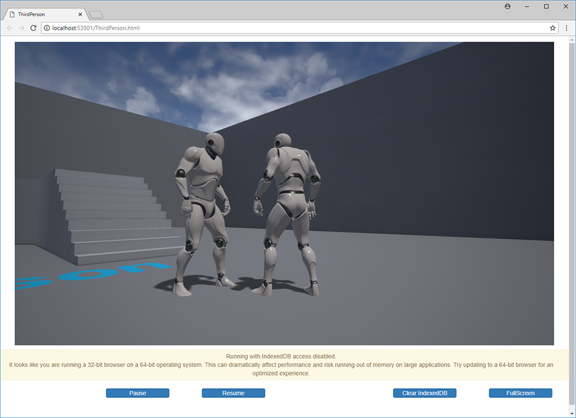

# Note: this page has been archived

And left here for reference purposes.

The latest detailed instructions on packaging Unreal Engine for HTML5 are all
placed in the [HowTo](../HowTo/README.md) section.

* * *
* * *

# Developing HTML5 Projects

Setting up UE4 for HTML5 development.

## HTML5 SDK Setup

The Unreal Engine 4 (UE4) HTML5 implementation utilizes the [Emscripten](https://github.com/emscripten-core/emscripten) toolchain (originally from [Mozilla](https://developer.mozilla.org/en-US/docs/Mozilla/Projects/Emscripten)) to cross-compile UE4's C++ code into WebAssembly (WASM).  The Community-supported HTML5 platform extension will require this and addtional tools to be manually downloaded, installed and setup before being able to create HTML5 projects.

* * *
## HTML5 Supported Web Browser

### 64-bit Browser

Running UE4 HTML5 is highly recommended with a **64-bit** version web browser. You can find 64-bit versions of the Google Chrome and Firefox web browsers using the following links

*   [Google Chrome 64 Bit](https://www.google.com/chrome/beta/)

*   [Firefox 64 Bit](https://www.mozilla.org/en-US/firefox/all/)

### Multi-thread Support

Multi-threaded support is available for UE4 HTML5.

Some browsers may still need special flags enabled to be allowed to run in multi-threaded mode.

*   In **Chrome**: launch with the following flags:
    *    `--js-flags=--experimental-wasm-threads --enable-features=WebAssembly,SharedArrayBuffer`
    *     Alternately, these can be enabled and disabled in `chrome://flags/#enable-webassembly-threads` as "WebAssembly threads support"

*   In **Firefox**, **SharedArrayBuffer** can be enabled in `about:config` by setting the `javascript.options.shared_memory preference to true`.

* * *
## UE4 Editor

### HTML5 Required Project Setup

In order to get your UE4 powered HTML5 project working correctly you will need to disable MSAA from the [Project Settings](https://docs.unrealengine.com/en-US/Engine/UI/ProjectSettings). This can be done by going to **Project Settings** > **Rendering** > **Mobile** and then setting the **Mobile MSAA** option to **No MSAA**.

### HTML5 Build Type

When creating a build of your HTML5 project, you have the option of creating a **Development Build** or a **Shipping Build**. The type of build that you create for your project depends on what you are trying to accomplish.

### HTML5 Development Builds:

*   Development builds are used when you are testing or debugging your project before you want to release it.

*   Development builds will only generate uncompressed files.

*   Development builds should only be used with local testing and are not meant to be deployed to a website.

>   You can find more information about building your project for Development in the [HowTo](../HowTo/README.md) pages.

### HTML5 Shipping Builds:

*   Shipping builds are used when you are ready to release your project to end users.

*   Shipping builds can generate either compressed (for smaller download size) or uncompressed files.
    *    However, smashing your texture sizes has yield the best results for download size savings.
    *    See [Textures for Mobile Platforms](https://docs.unrealengine.com/en-US/Platforms/Mobile/Textures/index.html), section **Per-Device Texture LOD**, and **especially step #4** for more details on how to do this.
         *    For HTML5, try setting Max LOD Size to 256 and go up from there to ensure quality and download size are acceptable.

>   You can find more information about building your project for Shipping in the [HowTo](../HowTo/README.md) pages.

### Compression and PakFiles

**NOTE: compression option is not needed anymore since switching to WASM. Left here for reference.**
*    (Use uncompressed builds for the best results on being able to server your project from most web host providers.)

You can enable or disable compressing files for shipping HTML5 builds by doing the following:

1.  Go to **Project Settings** > **Platforms** > **HTML5** > **Packaging** and then make sure to enable **Compress files during shipping packaging**.

    

1.  It is also recommended that you **disable** the **Use Pak File** option by going to **Project Settings** > **Packaging** > **Packaging** and disable the **Use Pak File** option by clicking on the box next to its name.

    

**AGAIN: compression option is not needed anymore since switching to WASM. Left here for reference.**
*    (Use uncompressed builds for the best results on being able to server your project from most web host providers.)

* * *
## Launching HTML5 Projects (i.e. from Editor)

Once you have installed one of the compatible web browsers you can then test one of your HTML5 project. You can do this by:
*    going to the **Main Tool Bar**
*    next to the **Launch** button
     *    click on the **Advanced Options** (drop-down-arrow)

Then, in the **Devices** menu:
*    select the browser you wish to use by clicking on it

     

* * *
## Packaging HTML5 Projects (for your web server)

To create a packaged HTML5 project that can be deployed to the web, you will need to do the following.

1.  First, go to **File** > **Package Project** and select **HTML5** from the list.

    

1.  Select a folder for the project to be saved and then click **Select Folder** to start the packaging process.

* * *
## Testing Locally

### UE4's test web server

Once the project has finished being packaged:
*    open the folder the project was packaged to

     

*    run the program **HTML5LaunchHelper.exe** (on windows) or **RunMacHTML5LaunchHelper.command** (on Mac)
     *    this starts a web sever which is configured to serve compressed files on localhost
     *    NOTE: this is **NOT** a production quality server
*    if necessary, add -ServerPort=XXXX to the command line to change the serving port
	 *    default port is 8000

You can see the progress of this server in the command line window that is displayed when the **HTML5LaunchHelper.exe** program is run.

Finally, open up your 64-bit web browser of choice and input the following URL:
*    `http://localhost:8000/[ProjectName].html`
*     This will load your UE4 HTML5 project in the web browser like in the image below (please ignore the URL seen here, this is from when **Launcher** is used (see [above](#launching-html5-projects))).

     

     >    Again, the URL that you input is based off of your project name. With the above project called **ThirdPerson** the address that should be input would be `http://localhost:8000/ThirdPerson.html`

### Python web server

You may use python's built in web server, e.g.:
*    (from the command prompt, to where the the [project].html file is located)

     >    `python -m SimpleHTTPServer 8000`

### Apache/NGINX/other web server(s)

OSX and Linux normally have Apache installed.  NGINX can also be used as well.

*   You can use these (or any of your other favrites) for testing -- which may have the closest behavior to most web host providers.
    *     If you are reading this section, we assume you have a deep understanding of web server technology.  This is not for beginners.

* * *
## HTML5 File Types

When building your UE4 project for development or deployment with HTML5 you have the option to use compressed or uncompressed files. The following chart breaks down what files are required for uncompressed builds and what information these files contain.

### Files Required for Non-Compressed Files Deployment
The following files are created when a non-compressed build is created.

|File Type|Description|
| --- | --- |
| **[project].html** | Main project Landing page (see template code). |
| **[project].UE4.js** | Main project Javascript code (see template code). |
| **[project].css** | Main project CSS code (see template code). |
| **[project].wasm** | Main game code (generated). |
| **[project].js** | Main game code (WASM) Javascript driver (generated). |
| **[project].data** | Game content (generated). |
| **[project].data.js** | Game content Javascript driver (generated). |
| **Utility.js** | Utility (open source) Javascript code. |
| **.htaccess** | Distributed configuration file |

> Note: template code can be found in `Engine/Platforms/HTML5/Build/TemplateFiles`

### Files Required for Compressed Files Deployment

**AGAIN: compression option is not needed anymore since switching to WASM. Left here for reference.**
*    (Use uncompressed builds for the best results on being able to server your project from most web host providers.)

The following files are created when a compressed build is crated.

|File Type|Description|
| --- | --- |
| **[project].UE4.jsgz** | Compressed main project Javascript code. |
| **[project].wasmgz** | Compressed main game code. |
| **[project].jsgz** | Compressed main game (WASM) Javascript code. |
| **[project].datagz** | Compressed game content. |
| **[project].data.jsgz** | Compressed game content Javascript driver. |
| **Utility.jsgz** | Compressed utility (open source) Javascript code. |

> When using the compressed version of the files you will also need to make sure to include the uncompressed version of the **.htaccess** file and the **.html** file.

If you are an advanced web server administrator:
*    Using compression helps improve download times.
*    Using pre-compressed files may help your web server from compressing the files dynamically everytime the time your project is loaded on to a browser.
*    NOTE: Being able to serve pre-compressed files will require configuring your web server to properly serve the UE4 compressed file extention type.
     *    These settings are placed in the .htaccess file
          *    This file will work on most Apache web servers (that have the AllowOveride option set to (e.g.) All).
     *    AGAIN, if you are reading this section, we assume you have a deep understanding of web server technology.
          *    This is not for beginners.

**AGAIN: compression option is not needed anymore since switching to WASM. Left here for reference.**
*    (Use uncompressed builds for the best results on being able to server your project from most web host providers.)

### Files not needed for Deployment
The following files are created when both a compressed and uncompressed version of the project is created. However these files are only needed when your project is under development or being tested.

|File Name|Description|
| --- | --- |
| **HTML5LaunchHelper.exe** | Used to create a local web server to view your project locally on Windows based PC's. |
| **RunMacHTML5LaunchHelper.command** | Used to create a local web server (via HTML5LaunchHelper) to view your project locally on Mac. |
| **Readme.txt** | Contains additional information about deploying UE4 project for HTML5. |

### Files no longer generated
The following files used to be created when using older emscripten toolchain.

|File Name|Description|
| --- | --- |
| **[project].symbols** | Symbols (optional: used with debugging). |
| **[project].mem** | Pre-allocated memory file. |

* * *

