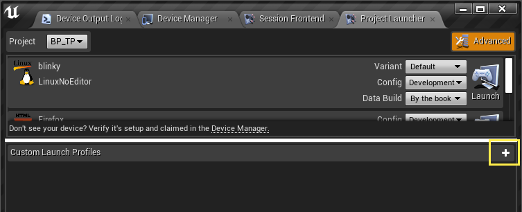
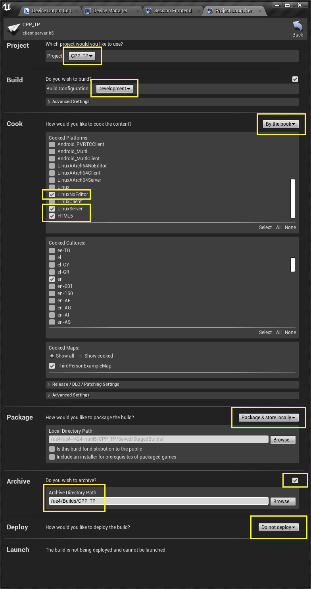
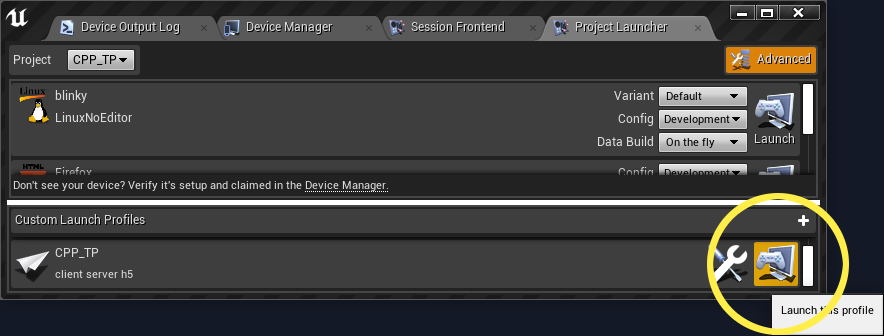
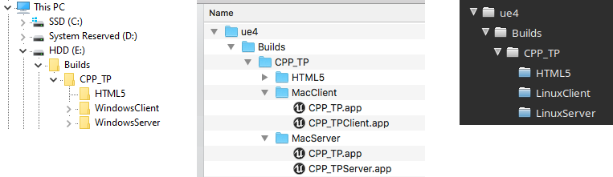

# Emscripten and UE4

this page will show you how to:

- run [HTML5Setup.sh](#html5setupsh-build-script) build script -- which will automatically:
	- fetch `EMSDK` (which will be used to install the `Emscripten Toolchain`)
	- build all of the UE4 Thirdparty libraries used for HTML5
- [package a UE4 sample project for HTML5](#package-a-sample-blueprint-project-for-html5)
- play a [UE4 multi-player game with HTML5](#ue4-multi-player-testing-with-html5)
- [upgrade the emscripten toolchain](#upgrading-emscripten-toolchain)
	- and show which UE4 `C#` files are essential (to add/modify emscripten commands used) during HTML5 packaging


* * *
## First Things First

back in [Get Source File](README.0.building.UE4.Editor.md#get-source-files), a clone of a
special branch based on Release-4.24.3 was used (which was put in (e.g.) `.../ue4-4.24.3-html5`
and will be used in this HowTo page) -- with the HTML5 platform files already populated.

- NOTE: this is the last snapshot for HTML5 that is now "no longer supported" by Epic Games
	- HTML5 has been moved (out) as a `Platform Extension` to be community-driven at this point
	- but, work as gone in to help provide a working "staring point"
		(especially as the last **ES2** (WebGL1) render target) for this new (platform extensions) mechanism
	- these pages and files are the results of that work


DO NOT IMMEDIATELY TRY TO UPGRADE ANYTHING IF THIS IS YOUR FIRST TIME HERE !!!

that said, if you want to work off of a newer version of Unreal Engine,
extra information is placed in:
- [UE4 HTML5 F.A.Q.](README.4.faq.UE4.HTML5.md#trying-to-get-latest-unreal-engine-working-with-html5-platform-extensions)
	- along with addtional steps to take to put HTML5 back into the repository tree

- NOTE: this is **NOT** the same thing as upgrading the emscripten toolchain
	- upgrading emscripten is a lot more straight-forward than upgrading Unreal Engine
	- upgrading the emscripten toolchain will be shown at the end of this page
	- upgrading Unreal Engine, again, is put in the FAQ section (see just above)

AGAIN, DO NOT IMMEDIATELY TRY TO UPGRADE ANYTHING IF THIS IS YOUR FIRST TIME HERE !!!


moving on...


* * *
* * *
## HTML5Setup.sh Build Script

> NOTE: if you are continuing from the previous [HowTo](README.0.building.UE4.Editor.md#generate-projectmake-files)
	and have already run `HTML5Setup.sh`, you can skip down to the next section:
	[Package a Sample BluePrint Project For HTML5](#package-a-sample-blueprint-project-for-html5)

> but, if you want to understand what `HTML5Setup.sh` does, please continue reading on.


in order to package Unreal Engine for HTML5, we need to perform a number of steps
to get the UE4 Editor able to package for HTML5.
- NOTE: this only needs to be done **once** (per local repo)

all of these steps are all gathered in the (e.g.) `.../ue4-4.24.3-html5/Engine/Platforms/HTML5/HTML5Setup.sh`
build scripts.


### on Windows

open `git-bash`
- this was installed as part of the
	[Development Environment Requirements](README.0.building.UE4.Editor.md#development-environment-requirements) section
- change the directory to where your UE4 was cloned to
	- e.g. `cd ue4-4.24.3-html5`
- or, you can use **File Explorer** and right click on the **ue4-4.24.3-html5** folder and select `Git Bash Here`


### on Mac and Linux

open the Terminal

- change directory to the location where UE4 was cloned to (as we have seen
	in the [Generate Project/Make Files](README.0.building.UE4.Editor.md#generate-projectmake-files) section)
	- e.g. `cd ue4-4.24.3-html5`


### Fetch EMSDK and Build ThirdPary Libraries for HTML5

in `git-bash` (for windows) or in the `terminal` (for mac or linux), do the
following (yes, these commands will work the same on all 3 OS):

```bash
# remember, we are now in the ue4-4.24.3-html5 folder
cd Engine/Platforms/HTML5
./HTML5Setup.sh
```

this will take a while to complete (again, this is only a **one-time** setup):
- emsdk is a small and quick clone
- but, emscripten will take roughly 10 minutes or so
	> emscripten will also get **patched** that have been found to be needed with building for UE4
	(more about this in the [upgrading emscripten](#upgrading-emscripten-toolchain) section below)
- finally, building the thirdparty libraries will take an hour or two
	> please see the FAQ about why [emscripten ports](README.4.faq.UE4.HTML5.md#emscripten-ports) is not used in UE4


### Troubleshooting HTML5Setup.sh

if you see errors when running the script early on, please see the
UE4 HTML5 [Troubleshooting emsdk issues](README.4.faq.UE4.HTML5.md#troubleshooting-emsdk-issues) F.A.Q.

if you see errors fairly long into the run, please ensure you have plenty of hard drive space.
- how much hard drive space?
	- because you will also be building UE4 Editor (giant), UE4 tools (small), and some projects (can be giant)
	- look to have more than 150GB of free hard drive space


* * *
* * *
## Package a Sample BluePrint Project For HTML5

these should now start to now look more familiar to you.

restart the Editor with the project name appended:
- note the use of `BP_FP` here (that was created in [Creating a Sample Blueprint Project](README.0.building.UE4.Editor.md#-creating-a-sample-blueprint-project-))

#### on Windows

	...\Engine\Binaries\Win64\UE4Editor.exe BP_FP -log

#### on Mac

	open .../Engine/Binaries/Mac/UE4Editor.app --args BP_FP -log

#### on Linux

	.../Engine/Binaries/Linux/UE4Editor BP_FP -log

> TIP: put the command in a shortcut (or alias, script, etc.)


### Readying UE4Editor

let's go over this part [again](README.0.building.UE4.Editor.md#window-2) now that we are looking at HTML5:

#### window #2

- Menu bar -> Edit -> Project Settings ...
	- click around (and look around) the **Project Settings** categories and options for EVERYTHING (including the kitchen sink)

	- (**NEW**) here's a list I always click on **and** look at before each and every packaging (for all platforms):
		- Project -> Maps & Modes
			- **Default Maps** -> Game Default Map
		- Project -> Packaging
			- Packaging -> **Use Pak File**
				- I normally **UN**check this to help the asset builds (i.e. "cooking") go a little faster
					(by not having to build this additional step) -- emscripten has it's own assets bundler
					mechanism (see [Emscripten Packaging Files](https://emscripten.org/docs/porting/files/packaging_files.html)
					for more information about this)
				- if you're looking for compression: please see the [smash texture size](README.2.advanced.UE4.HTML5.md#smash-texture-sizes)
					for the most effective way to crush your download size
			- Project -> **Full Rebuild**
				- just make a note this exists here
		- Engine -> Rendering
			- Mobile
				- note: the HTML5 render path uses the same one writen for mobile, that's why it's good to check-in here every now and then
					- again, ue4 HTML5 is currently rendering with ES2 (WebGL1) -- but, note that in 4.25 ue4 will
						[drop support for ES2](README.4.faq.UE4.HTML5.md#warning-this-is-not-for-the-faint-of-heart)
				- see [Content Development](../HTML5.md#content-development) and
					[Mobile MSAA](../GettingStarted/HTML5GettingStarted.md#html5-required-project-setup)
					just in case you are see rendering issues on your projects
		- Platforms -> HTML5
			- Emscripten -> **Multithreading support**
				- for 4.24 (as well as 4.24.3) -- this MUST be enabled (there's a (animation curve) crash bug in single threaded mode
					that is slated to be fixed in 4.25)


### Build the Sample BluePrint Project

set the build type:
- Menu bar -> File -> **Package Project** -> Build Configuration
	- select `Development` (we are going to use the **game console** to **open a connection** to the game server below)

finally, package for HTML5:
- Menu bar -> File -> Package Project -> **HTML5**
	- select the folder where the final files will be **archived** to
		- e.g. on Windows: `D:\Builds\BP_FP\`
		- e.g. on Mac or Linux: `/ue4/Builds/BP_FP/`

	- this is going to take while to complete... (more about this in the [upgrading emscripten](#upgrading-emscripten-toolchain) section below)
		- go take a nap

note: if you run into any problems here, take a look at the [FAQ](README.4.faq.UE4.HTML5.md)
to see if there are any common issues that you might be hitting.


* * *
## Test Sample BluePrint Project for HTML5

### on Windows via File Explorer

- open `File Explorer` to the location where files were **archived** to
	- e.g. `D:\Builds\BP_FP\HTML5`
	- double click on `HTML5LaunchHelper.exe`


### on Mac via Finder

- open `Finder` to the location where files were **archived** to
	- e.g. `/ue4/Builds/BP_FP/HTML5`
	- double click on `HTML5LaunchHelper.command`


### on Windows, Mac or Linux via command line

in `git-bash` (for windows) or in the `terminal` (for mac or linux), you can
use python's built in web server to host the files quick and easy.

#### on Windows

```bash
# remember, this is an "example" path (see "archive to" notes just above)
cd /D/Builds/BP_FP/HTML5
python -m http.server 8000
#python2 -m SimpleHTTPServer 8000
```

#### on Mac or Linux

```bash
# remember, this is an "example" path (see "archive to" notes just above)
cd /ue4/Builds/BP_FP/HTML5
python -m http.server 8000
#python2 -m SimpleHTTPServer 8000
```


* * *
## Chrome or Firefox (64-bit version recommended)

- open browser to http://localhost:8000/
	- click on the relevant HTML file ( e.g. http://localhost:8000/BP_FP.html )


in general -- i use both chrome and firefox when testing.  note: they both will
periodically "get broken" for some reason or another -- but, they usually get
fixed in the next revision or two.

i normally have these browsers installed on ALL of my desktops (windows, mac and linux):
- Chrome (stable)
- Canary (chrome "unstable" i.e. alpha)
- Firefox (stable)
- Firefox Nightly ("unstable i.e. alpha)

those browsers above are the **BEST** at testing UnrealEngine projects in them.


#### Note: on Windows

- DO NOT USE EDGE
	- while it is now powered by chromium, it is not quite ready for webgl (yet).
	- see [caniuse webgl](https://caniuse.com/#search=webgl) for details


#### Note: on Mac

- DO NOT USE SAFARI
	- this browser has horrid support for WebGL(2)
	- see [caniuse webgl](https://caniuse.com/#search=webgl) for details


### other issues:

common run time in browser problems have been put into the [Browser F.A.Q.](README.4.faq.UE4.HTML5.md#browser)


* * *
* * *
## UE4 Multi-player Testing With HTML5

let's try something fun here.  in the last HowTo page, we were introduced to
the [UnrealFrontEnd](README.0.building.UE4.Editor.md#project-launcher-interface)
or UFE for short.
- we will use this to create a (Desktop) Server, Desktop Client and HTML5 Client
- again, because we are using a special branch here, much of the heavy work has already been done
	- an indepth "what was done" will be explained in the next HowTo:
		[Advanced Example of Building a UE4 HTML5 Project](README.2.advanced.UE4.HTML5.md)
	- however, we still need to add some code to the generated template (c++) project.
		> note: while it is possible to do the same for generated blueprint project, there
		are a number of additional steps required that are beyond the scope of this doc.
		see [xxx this F.A.Q.](README.4.faq.UE4.HTML5.md#xxx) if you are interested in knowing how.


### Client and Server C# files

let us add the additional required files to the project to allow us to create the
server and client (desktop) executables.

open your file explorer (windows), finder (mac) to the `CPP_TP/Source` folder.
- make a copy of the `CPP_TP.Target.cs` twice and rename them:
	- `CPP_TPClient.Target.cs`
	- `CPP_TPServer.Target.cs`

in each of those files a slight modification is needed to tell the build what targets
are wanted.  here are both files in their entirety:

- `CPP_TPClient.Target.cs`
```cs
using UnrealBuildTool;
using System.Collections.Generic;
public class CPP_TPClientTarget : TargetRules
{
	public CPP_TPClientTarget(TargetInfo Target) : base(Target)
	{
		Type = TargetType.Client;
		DefaultBuildSettings = BuildSettingsVersion.V2;
		ExtraModuleNames.Add("CPP_TP");
	}
}
```
> note the use of **Client** in this file


- `CPP_TPServer.Target.cs`
```cs
using UnrealBuildTool;
using System.Collections.Generic;
public class CPP_TPServerTarget : TargetRules
{
	public CPP_TPServerTarget(TargetInfo Target) : base(Target)
	{
		Type = TargetType.Server;
		DefaultBuildSettings = BuildSettingsVersion.V2;
		ExtraModuleNames.Add("CPP_TP");
	}
}
```
> note the use of **Server** in this file


* * *

let us continue with creating a `Custom Launch Profile` in the UFE to demonstrate
creating a multi-player project.

run **UnrealFrontEnd**:

##### on Windows

	...\Engine\Binaries\Win64\UnrealFrontend.exe

##### on Mac

	open .../Engine/Binaries/Mac/UnrealFrontend.app

##### on Linux

	.../Engine/Binaries/Linux/UnrealFrontend

click on the **Custom Launch Profiles** `Add` (plus-button):



to set up a multi-player session, we are going to build the desktop server and
desktop client (as our base line test system).  at the same time, we will also
build the HTML5 client.
- select **Project** to `CPP_TP`
- select **Build Configuration**
	- select `Development` (we are going to use the **game console** (via the **tilda** (`~`) key)
		to **open a connection** to the game server below)
	- but, you can select `Shipping` when deploying for release (just note: **game console** will NOT be available in `Shipping` builds)
- select **Cook** to `By the book`
- select **Cooked Plaforms** for:
	- on Windows: `WindowsClient` and `WindowsServer`
	- on Mac: `MacClient` and `MacServer`
	- on Linux: `LinuxClient` and `LinuxServer`
	- AND HTML5

NOTE: the following "client" variants are all essentially the same (for the respective platforms):
- `Windows & WindowsNoEditor` and `WindowsClient`
- `Mac & MacNoEditor` and `MacClient`
- `Linux & LinuxNoEditor` and `LinuxClient`

> in this example, if you clicked on ALL 3 of these "client" variants, the `Client` variant is ONLY built.

- select **Package** to `Package & store locally`
- in **Archive**, check the box `on`
	- and set the archive path:
		- e.g. on Windows: `D:\Builds\CPP_TP\`
		- e.g. on Mac or Linux: `/ue4/Builds/CPP_TP/`
- select **Deploy** to `Do not deploy`



now, press the `Back` button (upper right) which will automatically save this new profile
- note: if you wanted to change the name of the profile, edit the profile again
	by clicking on the **Edit** (wrench and screwdriver) button, double click on
	`New Profile` and type a name for this profile
- you can also give this profile a small description by double clicking on the
	`Enter a description here.` and type what ever you want for this profile

back in the **Project Launcher** click on the `Launch` button for your profile
to begin packaging everything.



after the build is done (which may take a while to complete) in your **archive**
folder, you should see something like this:




### Launch the Server

here, we will be using the more advanced way to run the project from the command line.

- first, tell the server to host with the map: **ThirdPersonExampleMap**

- as before, i like to see the `stdout` prints -- to know that the game is still running
	- using `-log` parameter to view this


#### on Windows via CommandPrompt:

- open `CommandPrompt` to the location where the Server files were **archived** to
	- e.g. `cd ...\CPP_TP\WindowsServer`
- run executable
	- `CPP_TPServer.exe ThirdPersonExampleMap -log`

#### on Mac via Terminal:

- open `terminal` to the location where files were **archived** to
	- e.g. `cd .../CPP_TP/MacServer`
- run executable
	- `open ./CPP_TPServer.app --args ThirdPersonExampleMap -log`

#### on Linux via Terminal:

- open `terminal` to the location where files were **archived** to
	- e.g. `cd .../CPP_TP/LinuxServer`
- run executable
	- `./CPP_TPServer.sh ThirdPersonExampleMap -log`

> TIP: put the command in a shortcut (or alias, script, etc.)


### Launch the Desktop Client

to run multiple instances of the project at once (this networking project is a
perfect example), this time we will launch the game in `windowed` mode from the

- run the game in a windowed size screen (i.e. not full screen)
	- using `-windowed -resx=800 -resy=600` parameter to do this

- again, i like to see the `stdout` prints -- to know that the game is still running
	- using `-log` parameter to view this

#### on Windows via CommandPrompt:

- open `CommandPrompt` to the location where the Server files were **archived** to
	- e.g. `cd ...\CPP_TP\Windowslient`
- run executable
	- `CPP_TPClient.exe -windowed -resx=800 -resy=600 -log`

#### on Mac via Terminal:

- open `terminal` to the location where files were **archived** to
	- e.g. `cd .../CPP_TP/MacClient`
- run executable
	- `open ./CPP_TPClient.app --args -windowed -resx=800 -resy=600 -log`

#### on Linux via Terminal:

- open `terminal` to the location where files were **archived** to
	- e.g. `cd .../CPP_TP/LinuxClient`
- run executable
	- `./CPP_TPClient.sh -windowed -resx=800 -resy=600 -log`

> TIP: put the command in a shortcut (or alias, script, etc.)


### Launch the HTML5 Client

using almost the same steps from [test sample blueprint project for HTML5](#on-windows-mac-or-linux-via-command-line) above:

#### on Windows, Mac or Linux via command line

in `git-bash` (for windows) or in the `terminal` (for mac or linux), you can
use python's built in web server to host the files quick and easy.

```bash
# remember, this is an "example" path (see "archive to" notes just above)
cd .../CPP_TP/HTML5
python -m http.server 8000
#python2 -m SimpleHTTPServer 8000
```

and using almost the same steps from [chrome or firefox](#chrome-or-firefox-64-bit-version-recommended) above:

- open browser to http://localhost:8000/
	- click on the relevant HTML file ( e.g. http://localhost:8000/CPP_TP.html )


### Finally...

in the desktop client AND HTML5 browser:
- open the `game console` command line, by pressing the **tilda** key (`~`)
	- type: `open 127.0.0.1`
		- here, we are telling the `client` to open a connection to the `server`
			(hosted at 127.0.0.1 -- a.k.a. `localhost`)

you should see the game reload, and as more clients join the server - the more
players you will see in there!


> again, we will do an [Advanced Example of Building a UE4 HTML5 Project](README.2.advanced.UE4.HTML5.md)
multi-player example in the next HowTo.


* * *
* * *
## Upgrading Emscripten Toolchain

this may only be of interest to anyone who wishes to keep this community-supported
project going.

this section will go over what [HTML5Setup.sh](#html5setupsh-build-script) does in detail.
- we will perform an `emscripten toolchain` upgrade when explaining this
	- some reasons for upgrading the emscripten toolchain include:
		- bug fixes
		- new features
		- link times have vastly improved with emscripten "upstream" (clang 10)
			- but, at the time of this writting, thirdparty libraries built with emscripten "upstream" will crash at runtime
			- thus, emscripten "fastcomp" (clang 6) is still used when building thirdparty libraries
			- this will get fixed someday and the `HTML5Setup.sh` build script will be updated to make use of that when the time comes


### EMSDK

`HTML5Setup.sh` will aways pull a fresh copy of emsdk into its own folder
- i.e. i never `git pull` on my local emsdk weeks/months down the line
- i do this to ensure there are no extra files from older versions getting accidentally left around
	- in other words, we do not wish to pollute new versions with old stuff
- also, having multiple versions in their own folders allows us to quickly change between toolchain versions for testing purposes

> note: when building emscripten from source (i.e. not the precompiled
SDK - e.g. `incoming` branch) -- then yes, i would `git pull` -- but,
this is usually (again) in a separate WIP folder...


### Upgrade Emscripten Version

let's start the upgrade.
- edit `HTML5Setup.sh` file
- look for the `EMVAR` variable (very near the top of the file)
	- it is currently set to `1.39.0`
	- let's change this to `1.39.4` (or `latest` if you're bleeding edge)
- save the file and exit your text editor

re-run HTML5Setup.sh using pretty much the same steps from
[Fetch EMSDK and Build ThirdPary Libraries for HTML5](#fetch-emsdk-and-build-thirdpary-libraries-for-html5)
above.

in `git-bash` (for windows) or in the `terminal` (for mac or linux):

```bash
# remember, we are now in the ue4-4.24.3-html5 folder
cd Engine/Platforms/HTML5
./HTML5Setup.sh
```

again, this may take an hour or so to complete.

- but, this is also where most compiler issues arise
	- some due to new compiler warnings (set to be treated as errors)
	- others due to deprecated compiler options
	- and so on

- take a look at [this FAQ](README.4.faq.UE4.HTML5.md#common-compiler-issues-when-upgrading-emscripten-toolchain) to see tips on how to fix this


### HTML5Setup.sh Deep Dive

follow along this explaination by opening a page to
[HTML5Setup.sh](https://github.com/UnrealEngineHTML5/UnrealEngine/blob/4.24.3-html5-1.39.18/Engine/Platforms/HTML5/HTML5Setup.sh)
file.
- again: if you see a `404 This is not the web page you are looking for` error
	- `Remember to link your Epic Games Account to your GitHub account.` See [HERE](../../../README.md) for more details.


#### UnrealBuildTool HTML5 Injection

because HTML5 is (think of it as) a "new" platform, UnrealBuildTool (UBT) needs
to be told about this.  This is done by injecting the HTML5 c# paths into UBT.

```c
patch_UBT_HTML5()
```


#### Patching UE4 Code

Unreal Engine code is edited and checked in by Epic Games developers and
is eventually propagated to the github repositories.  this was a tiny fix
that didn't make the lock down window.

see [this F.A.Q.](README.4.faq.UE4.HTML5.md#tobool63i--icmp-slt-i176)
for details.

```c
patch_UE4_code()
```


#### Patching emscripten

changes to emscripten were necessary to keep Unreal Engine HTML5 developement
stable and productive.  most of the edits were deemed specific to Unreal Engine
(i.e. not fit for the general public).  sometimes, fixes are no longer needed
and gets removed (or commented out for future reference).  but, some edits are
brought to the attention of the toolchain maintainers and may get pushed.  and
other times, we get them lost in the busy iterations only to be revisited at a
later time.

edits are wrapped between `EPIC EDIT` (to help me find these to re-apply them
in future version).  these included things like:
- verbose logging on timing data
- changes from `warning` to `info` log types (reducing false-positive alerts on Epic's CIS reports)
- hacks to "fix" c# and python issues on windows
- needed code changes (that helps make ue4 run in the browser)

> WARNING: do NOT just change the patch folder name (version) when upgrading your
emscripten toolchain. you MUST **manually inspect** the files to see if the
**EPIC EDIT** changes (still) makes sense in the (new) file they are to be put in.

> ALSO (just in case this is not obvious) -- if you just change the patch folder
name (i.e. version) -- you are going to STOMP on the newer file with older ones.
this may/will cause problems when the newer emscripten toolchain has been updated
but is running with (copied over) older files.


```c
patch_emscripten()
```


#### Fetch and Build

this part was already described [above](#fetch-emsdk-and-build-thirdpary-libraries-for-html5)


* * *
## Updating UE4 C# Scripts

the following files are used by Unreal's build system (specifically with the
emscripten toolchain) when packaging for HTML5:

##### Engine/Platforms/HTML5/Source/Programs/UnrealBuildTool/HTML5SDKInfo.cs
- the only things of interest here are the string variables listed at the top of the HTML5SDKInfo class
	- `SDKVersion` -- for this demo, change this to `1.39.4` (or `latest` if bleeding edge)
	- `NODE_VER`
	- `PYTHON_VER` -- (used on windows only)


##### Engine/Platforms/HTML5/Source/Programs/UnrealBuildTool/HTML5ToolChain.cs
- this is where everything is put on (1) setting up and (2) run emscripten
- THE functions that builds the emscripten command line options:
	- `GetSharedArguments_Global()` - used in both compilation and linking
	- `GetCLArguments_CPP()` - used in compilation only
	- `GetLinkArguments()` - used in linking only

> this file will sometimes need updating (e.g. new or deprecated compiler options)

> again, take a look at [this FAQ](README.4.faq.UE4.HTML5.md#common-compiler-issues-when-upgrading-emscripten-toolchain)
	to see if there are any common issues that you might be hitting


##### Engine/Platforms/HTML5/Source/Programs/AutomationTool/HTML5Platform.Automation.cs
- the top half of this C# file is where the files built are selected and archived
(as we have seen in [Build the Sample BluePrint Project](#build-the-sample-blueprint-project) above)
	- this is where emscripten sometimes changes the files:
		- generated that needs to be added to the **archive** process
		- or no longer generates and need to be removed from the **archive** process
- the rest of the file are used for UE4's Editor options that the HTML5 packaging supports


### a note on windows

after editing the AutomationTool and UnrealBuildTool files, these support
programs will need to be rebuilt.  on Mac and Linux, they are always rebuilt
at the start of any packaging process.

windows needs some help.

> NOTE: it seems that latest Editor will rebuild the C# (AutomationTool) project automatically when packaging (for example) HTML5.

> BUT: UnrealBuildTool still needs to be manually built on windows !!!

- **so**, every-now-and-then ... **this sometimes needs manual intervention:**
	- in the **Solution Explorer -> Solution -> Programs**, `Build` (the following support programs):
		- AutomationTool
		- UnrealBuildTool


* * *
## Test Upgraded Toolchain

be sure to package a "**SANITY CHECK"** build:
- no engine changes, just the build toolchain (emscripten) changes only

in this example, do the exact same steps done above:
- [Build the Sample BluePrint Project](#build-the-sample-blueprint-project)
- [Test Sample BluePrint Project for HTML5](#test-sample-blueprint-project-for-html5)
- [Chrome or Firefox (64-bit version recommended)](#chrome-or-firefox-(64-bit-version-recommended))


* * *
* * *

Next, [Advanced Example of Building a UE4 HTML5 Project](README.2.advanced.UE4.HTML5.md)

* * *
