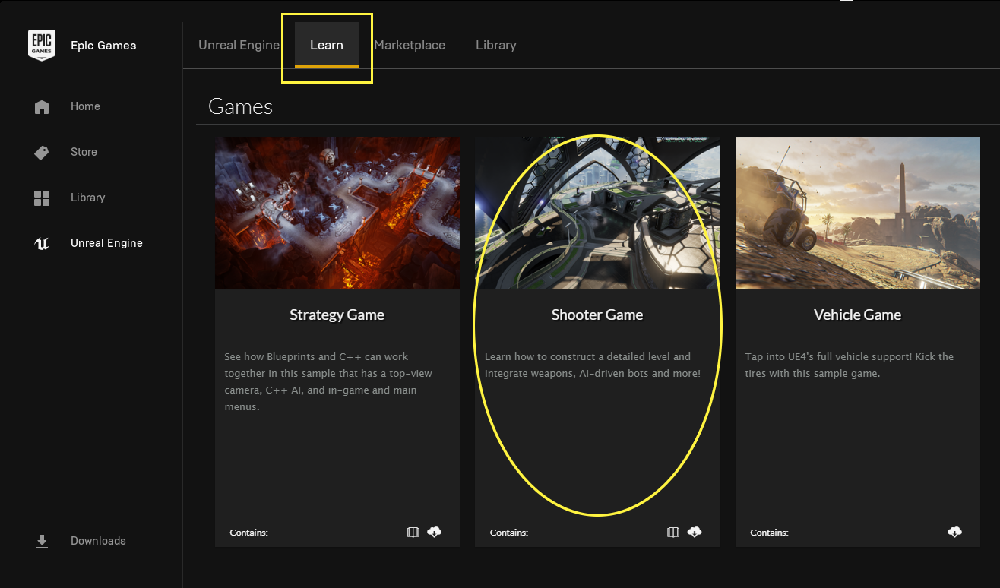
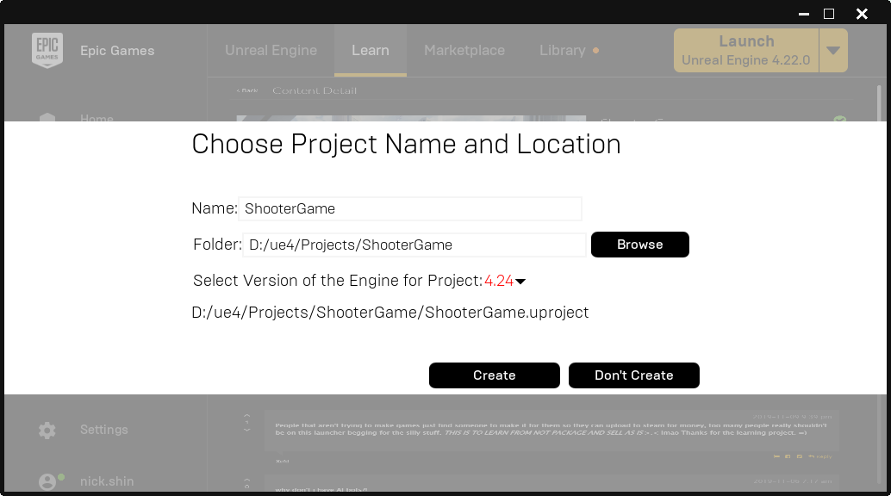
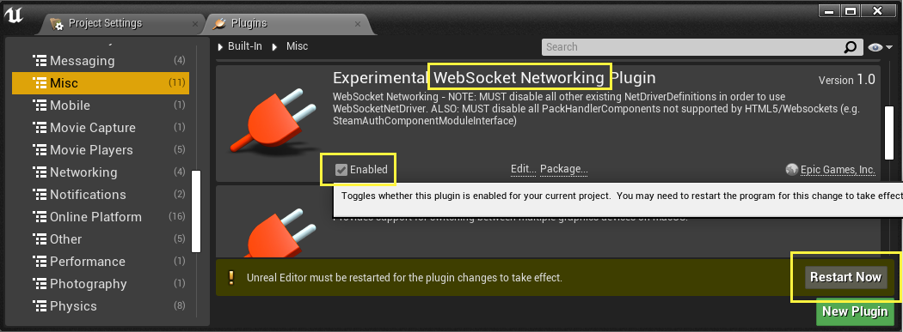
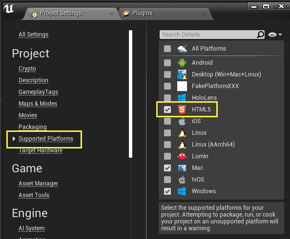
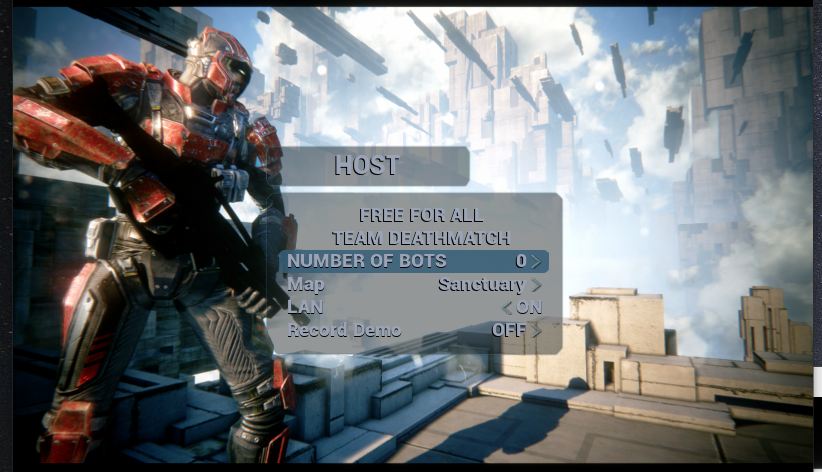
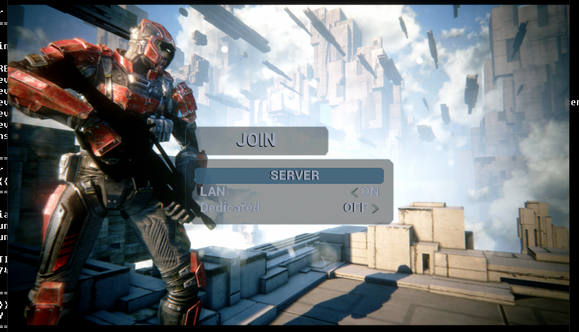
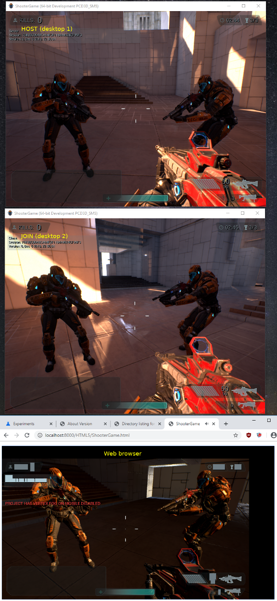
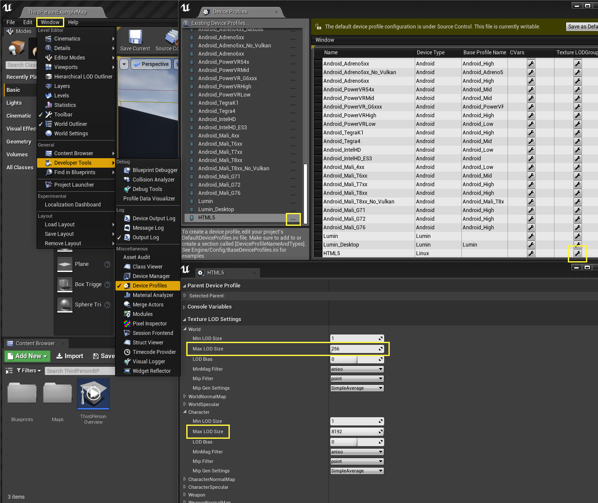

# Advanced Example of Building a UE4 HTML5 Project

this page will show you how to:

- [obtain a sample UE4 game project](#download-shootergame-sample-project) via the Epic Games Launcher
- [configure multiplayer project to use websockets](#configuring-ue4-projects-with-websocket-networking)
- [play a multiplayer game session with desktop client host and HTML5 client](#test-html5-client-with-desktop-shootergame-host)
- [smash texture sizes]()
- [view modes in editor]()


* * *
## Epic Games Launcher

normally, game developers (who do not have much or any programming experience)
can download the **Epic Games Launcher** to get the Unreal Engine Editor and to
start making games with it.

you can also download a number of sample projects from the "Learn" that's
available via the **Launcher**.

we will use one of Epic Games sample projects from the Launcher's **Learning**
center to continue with this advanced demo.


### Downloading the **Epic Games Launcher**

to obtain the **Launcher**, download it from:

- https://www.epicgames.com/store/en-US/download
	- Windows and Mac
- https://lutris.net/games/epic-games-store/
	- Linux (requires Wine)

after opening up the **Launcher**, you will be required to **Sign In** in order
to use it.  use **your** Epic Games account credentials you've used when linking
your GitHub account (we saw how to do this [HERE](../../../README.md)).


### Download ShooterGame sample project

to download the **ShooterGame** project:
- open **Epic Games Launcher** application
- goto the **Learn** tab
- scroll down to the **Games** section
- click on **ShooterGame** to view the project



- click on Free
- click on Create Project
- pick the path to download the project to
	- in this example, i have put ShooterGame in the same folder where **Engine**
		is -- i.e. `.../ue4-4.24.3-html5/ShooterGame`.  it doesn't have to be there.
		but, for this demo, you can put it there to follow along these instructions.
- select the engine version: 4.24
- click on Create




* * *
### ALERT: on Mac and Linux

at the time of this writing, we need to patch one file in the ShooterGame project.
(by the time you read this, this may have been fixed.  but, just in case it is still
broken on mac and linux, you will need this fix.)

- edit the following file: `.../ShooterGame/Source/ShooterGame/ShooterGame.Build.cs`
	- add the `"RHI"` module to the `PrivateDependencyModuleNames` array
	- it should look something like this:

```cs
. . .
        PrivateDependencyModuleNames.AddRange(
			new string[] {
				"RHI",	// ADD ME!
				"InputCore",
. . .

```


* * *
## Build ShooterGame "Editor"

when ever starting a new project that contains source codes, i usually run the
`GenerateProjectFiles` command (that we saw in [Generate Project/Make Files](README.0.building.UE4.Editor.md#generate-projectmake-files)).

this may have been done for you automatically when using the **Epic Games Launcher**.

but, it's good practice to do this when ever you start playing playing with
**new** projects that contain source codes.  and this example is a good one
to start with.

#### on Windows via CommandPrompt

- open `CommandPrompt` to ue4-4.24.3-html5
	- e.g. `cd ...\ue4-4.24.3-html5`
- re-generate the visual studio solution file
	- `GenerateProjectFiles.bat`
- open the generated visual studio solution (UE4.sln)
	- in **Solution Explorer-> Solution -> Games**, `right click select` and `build` **ShooterGame**

#### on Mac via Terminal

- open `terminal` to ue4-4.24.3-html5
	- e.g. `cd .../ue4-4.24.3-html5`
- re-generate the xcode project file
	- `GenerateProjectFiles.command`
- open the generated xcode project (UE4.xcworkspace)
	- select target **ShooterGame**
	- and then select:
		- **Menu -> Product -> Build For -> Running**
		- or `Command + Shift + R`

#### on Linux via Terminal

- open `terminal` to ue4-4.24.3-html5
	- e.g. `cd .../ue4-4.24.3-html5`
- re-generate the Makefiles
	- `GenerateProjectFiles.sh`
- and then:
	- `make ShooterGame ShooterGameEditor`


* * *
## Open ShooterGame in UE4Editor

when the build completes, fire up the Editor:
- note: i like to see the `stdout` prints (to know that the Editor is still running)
	- using `-log` parameter to view this

### on Windows

	...\Engine\Binaries\Win64\UE4Editor.exe ShooterGame -log

### on Mac

	open .../Engine/Binaries/Mac/UE4Editor.app --args ShooterGame -log

### on Linux

	.../Engine/Binaries/Linux/UE4Editor ShooterGame -log

> TIP: put the command in a shortcut (or alias, script, etc.) for future use!


* * *
#### SPECIAL NOTE: Enable WebSocket Networking Plugin

we saw how to do this back in the first HowTo:
- [enable websocket networking plugin](README.0.building.UE4.Editor.md#plugins)




* * *
## ShooterGame for Desktop

just like [Starting with UE4 Editor](README.0.building.UE4.Editor.md), we will
first build for the Desktop to ensure the project (still) "works" before trying
other platforms.
- it is much easier to debug or trying to diagnose any problems on the "Native Platform" first (i.e. the desktop)

ShooterGame is a fully fleshed out project that can host network games.

- usually, a server is used to host these game sessions
	- Unreal Engine make these and are known as "UE4 Dedicated Servers"
	- an example of this was done in the previous HowTo: [UE4 Multi-player Testing With HTML5](README.1.emscripten.UE4.HTML5.md#ue4-multi-player-testing-with-html5)

- another way to host game sessions is to have the running application **open a
	listening port** and perform the same functionality as a Dedicated Server
	(many console games do this)
	- we will be doing an example of this here

finally, the HTML5 client will need to connect to a **listening host**.
> NOTE: UE4 HTML5 will NEVER be able to "host" a game (it can join them, but never host).

for the purpose of this demo, we are going to use the "desktop game client" to
open a listening port to host a session.
- the HTML5 client will connect to this to play a networked game


### Configuring UE4 Projects with WebSocket Networking

in the previous previous HowTo, it was mentioned that the clone of a special
branch based on Release-4.24.3 was made with the HTML5 platform files already
populated.  this includes **config.ini** files.

in this HowTo, we will go through the steps to make UE4 networking projects work
on the HTML5 platform in detail.

normally, all desktop and most console platforms will be using what is known as
the Unreal Engine **IpNetwork** NetDriver for network communications.

- this needs to be change to use the **WebSocketNetwok NetDriver** ([1](#netdriverdefinitions-1))
- add the **WebSocketNetworking.WebSocketNetDriver** ([2](#add-websocketnetdriver-settings-2))
settings to the Engine
- and finally, **disable Packet Handler Components not supported with websocket** ([3](#disable-packethandler-components-3))
	- one such example is the **SteamAuthComponentModuleInterface**


we will now go over each of these (1-3) steps one by one.


#### NetDriverDefinitions (1)

in the following files:
- Engine/Config/BaseEngine.ini
- ShooterGame/Config/Windows/WindowsEngine.ini
- ShooterGame/Config/Mac/MacEngine.ini
- ShooterGame/Config/Linux/LinuxEngine.ini

**disable** all existing NetDriverDefinitions
- by placing a `;` (semicolon) at the start of each line
	- this is known as **commenting out** a line (which "disables" or "hides" them from being used)

in **BaseEngine.ini**, it would look like this:

```ini
;NetDriverDefinitions=(DefName="GameNetDriver",DriverClassName="/Script/OnlineSubsystemUtils.IpNetDriver",DriverClassNameFallback="/Script/OnlineSubsystemUtils.IpNetDriver")
;+NetDriverDefinitions=(DefName="DemoNetDriver",DriverClassName="/Script/Engine.DemoNetDriver",DriverClassNameFallback="/Script/Engine.DemoNetDriver")
```

next, **add** the WebSocket NetDriver - like this:

```ini
;NetDriverDefinitions=(DefName="GameNetDriver",DriverClassName="/Script/OnlineSubsystemUtils.IpNetDriver",DriverClassNameFallback="/Script/OnlineSubsystemUtils.IpNetDriver")
;+NetDriverDefinitions=(DefName="DemoNetDriver",DriverClassName="/Script/Engine.DemoNetDriver",DriverClassNameFallback="/Script/Engine.DemoNetDriver")
NetDriverDefinitions=(DefName="GameNetDriver",DriverClassName="/Script/WebSocketNetworking.WebSocketNetDriver",DriverClassNameFallback="/Script/WebSocketNetworking.WebSocketNetDriver")
```

**remember** to also do this in WindowsEngine.ini, MacEngine.ini or LinuxEngine.ini
(depending on the system you are using - or do it on all of them if you are not sure).

> note: **BaseEngine.ini** has been done for you (if you're using the special branch)

> repeat: **ShooterGame/Config/{Windows,Mac,Linux}/{Windows,Mac,Linux}Engine.ini**
will **NEED TO BE EDITED** with these changes mentioned above.


#### Add WebSocketNetDriver Settings (2)

at the end of **BaseEngine.ini** (and only this file), add the
**WebSocketNetworking.WebSocketNetDriver** settings at the end of the file:

```ini
[/Script/WebSocketNetworking.WebSocketNetDriver]
AllowPeerConnections=False
AllowPeerVoice=False
ConnectionTimeout=60.0
InitialConnectTimeout=120.0
RecentlyDisconnectedTrackingTime=180
AckTimeout=10.0
KeepAliveTime=20.2
MaxClientRate=15000
MaxInternetClientRate=10000
RelevantTimeout=5.0
SpawnPrioritySeconds=1.0
ServerTravelPause=4.0
NetServerMaxTickRate=30
LanServerMaxTickRate=35
WebSocketPort=8889
NetConnectionClassName="/Script/WebSocketNetworking.WebSocketConnection"
MaxPortCountToTry=512
```

> again, this has been done for you if you're using the special branch


#### Disable PacketHandler Components (3)

in the following files:
- Engine/Config/BaseEngine.ini
	- note: as of this writting, this is **not** seen in BaseEngine.ini -- but,
		it is mentioned here just in case you see this in the future...
- ShooterGame/Config/Windows/WindowsEngine.ini
- ShooterGame/Config/Mac/MacEngine.ini
- ShooterGame/Config/Linux/LinuxEngine.ini

find any **PacketHandler** Components sections, and disabling them by commenting them out.

for example, in **ShooterGame/Config/Windows/WindowsEngine.ini** -- this should look like this:

```ini
;[GameNetDriver PacketHandlerProfileConfig]
;+Components=OnlineSubsystemSteam.SteamAuthComponentModuleInterface
;
;[PendingNetDriver PacketHandlerProfileConfig]
;+Components=OnlineSubsystemSteam.SteamAuthComponentModuleInterface
```

> note the `;` (semicolon) at the start of the line indicating this line is disabled (commented out)


* * *
### Package ShooterGame for Desktop

using the same steps outlined in [Build Sample Project](README.0.building.UE4.Editor.md#build-sample-project)

set the build type:
- Menu bar -> File -> **Package Project** -> Build Configuration
	- select `Development` (i.e. keep the build type the same for all platforms)

finally, package for your desktop
- Menu bar -> File -> Package Project -> **Windows/Mac/Linux** (etc.)
	- select the folder where the final files will be **archived** to

> NOTE: on linux, you may need to enable it as a supported platform - see (HTML5)
	screenshot below to find where to enable it


### Package ShooterGame for HTML5

##### SPECIAL NOTE: enable the HTML5 as a supported platform




now, using the same steps outlined in [Build Sample Project](README.0.building.UE4.Editor.md#build-sample-project)

set the build type:
- Menu bar -> File -> **Package Project** -> Build Configuration
	- select `Development` (i.e. keep the build type the same for all platforms)

finally, package for HTML5
- Menu bar -> File -> Package Project -> **HTML5**
	- select the folder where the final files will be **archived** to


* * *
### Test Desktop ShooterGame Client

as we have seen in the previous HowTo's [multi-player testing](README.1.emscripten.UE4.HTML5.md#launch-the-desktop-client),
we will run this project in `windowed` mode from the command line.

- run the game in a windowed size screen (i.e. not full screen)
	- using `-windowed -resx=800 -resy=600` parameter to do this

- again, i like to see the `stdout` prints -- to know that the game is still running
	- using `-log` parameter to view this


#### on Windows via CommandPrompt

- open `CommandPrompt` to the location where files were **archived** to
	- e.g. `cd ...\ShooterGame\WindowsNoEditor`
- run executable
	- `ShooterGame.exe -windowed -resx=800 -resy=600 -log`

#### on Mac via Terminal

- open `terminal` to the location where files were **archived** to
	- e.g. `cd .../ShooterGame/MacNoEditor`
- run executable
	- `open ./ShooterGame.app --args -windowed -resx=800 -resy=600 -log`

#### on Linux via Terminal

- open `terminal` to the location where files were **archived** to
	- e.g. `cd .../ShooterGame/LinuxNoEditor`
- run executable
	- `./ShooterGame.sh -windowed -resx=800 -resy=600 -log`


> TIP: put the command in a shortcut (or alias, script, etc.) for future use!


### Another Desktop Client

for the purpose of this demo, open another client in windowed mode.

then, in the **first** game window, select:
- in **MAIN MENU -> HOST**
	- set **NUMBER OF BOTS** to 0 (zero)
	- click on **FREE FOR ALL**




now, in the **second** game window, select:
- in **MAIN MENU -> JOIN** (may have to click on **JOIN** twice)
	- click on **SERVER**
	- wait for your server to show up in the list, and then double click on it



you should now see the two game clients in the same match.


* * *
### Test HTML5 Client with Desktop ShooterGame Host

now, let's get the HTML5 client in the same match.

using the same steps from [launch the HTML5 client](README.1.emscripten.UE4.HTML5.md#launch-the-html5-client)
from the previous HowTo's multi-player testing example.


#### on Windows, Mac or Linux via command line

in `git-bash` (for windows) or in the `terminal` (for mac or linux), you can
use python's built in web server to host the files quick and easy.

```bash
# remember, this is an "example" path (see "archive to" notes just above)
cd .../ShooterGame/HTML5
python -m http.server 8000
#python2 -m SimpleHTTPServer 8000
```

and using almost the same steps from [chrome or firefox](#chrome-or-firefox-64-bit-version-recommended) above:

- open browser to http://localhost:8000/
	- click on the relevant HTML file ( e.g. http://localhost:8000/ShooterGame.html )

- join the desktop match:
	- NOTE: due to the way **ShooterGame** was designed, the **JOIN** mechanism will NOT WORK with the browser
	- SO, we are going to use the `game console` command line we've seen in
		[testing muti-player on HTML5](README.1.emscripten.UE4.HTML5.md#finally)
		in the last HowTo
	- open the `game console` command line, by pressing the **tilda** key (`~`)
		- type: `open 127.0.0.1`

you should see something like this:




> NOTE: if the desktop game match ended, just start a new match.  you might have
	to restart the whole server and client executable(s) -- so use multiple command
	prompts/terminals and use the `up` arrow to re-run the same command (or use
	the handy shortcut, alias, script, as recommended).


* * *
* * *
## smash texture sizes

let us take a look at a common issue with web browser games.  data size downloads
are quite sensitive to many users.  keeping them small while trying to keep up
visual quality up is a delicate balance.

for the purpose of this HowTo, we are going to reduce the texture sizes for
EVERYTHING for HTML5.

- Menu bar -> Window -> Developer Tools -> **Device Profiles**
	- in the Device Profiles -> **Existing Device Profiles** window
		- select the `HTML5 ...` (3 small "dots")
		- or the HTML5 `Texture LODGroup` (wrench icon)
	- this will bring up the **HTML5 Device Profile** settings window
		- set **ALL** `Max LOD Size` to 256 (to start)



- here, we see the `World` limit set to `256`
- do the same for ALL the other categories

doing this will greatly reduce the `<project>.data` file size

- repackage and notice the difference in the `data` file size


* * *
* * *
## view modes in editor

back in the [first HowTo: PIE](README.0.building.UE4.Editor.md#play-in-editor)
was mentioned.  here's a link that will explain this feature in better details:

- https://docs.unrealengine.com/en-US/Platforms/Mobile/Previewer/index.html

NOTE: for HTML5, set the Editor's previewer to the following to see (as close
as possible) for the following equivalent HTML5 rendering format:
- ES2: WebGL1
- ES3: WebGL2
- ES3.1: WebGL2 + WebGPU (someday...)


* * *
* * *

Next, [Debugging UE4 HTML5](README.3.debugging.UE4.HTML5.md)

* * *

